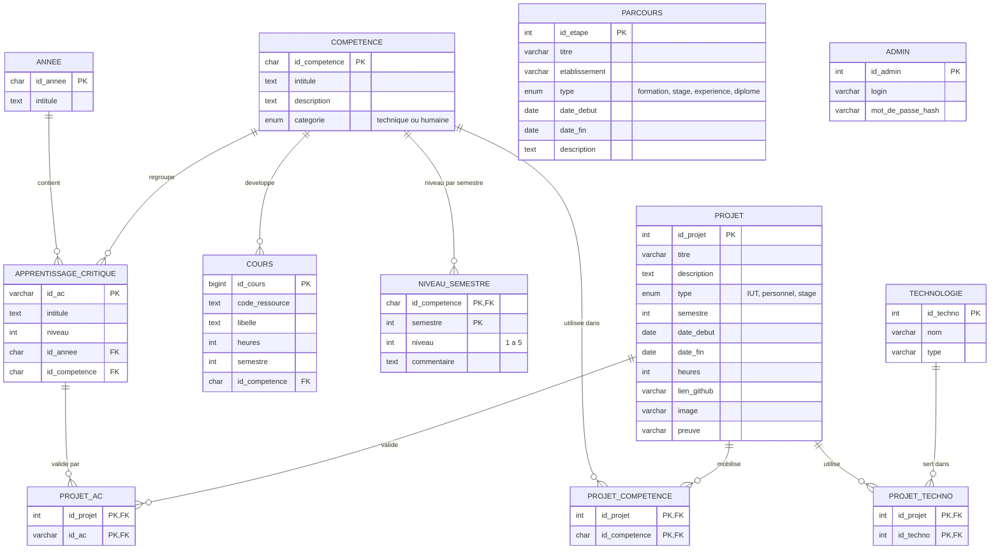

## Diagramme du schéma relationnel

```mermaid
erDiagram
  ANNEE ||--o{ APPRENTISSAGE_CRITIQUE : contient
  COMPETENCE ||--o{ APPRENTISSAGE_CRITIQUE : regroupe
  COMPETENCE ||--o{ COURS : developpe
  COMPETENCE ||--o{ NIVEAU_SEMESTRE : "niveau par semestre"
  COMPETENCE ||--o{ PROJET_COMPETENCE : "utilisee dans"
  PROJET ||--o{ PROJET_COMPETENCE : mobilise
  APPRENTISSAGE_CRITIQUE ||--o{ PROJET_AC : "valide par"
  PROJET ||--o{ PROJET_AC : valide
  PROJET ||--o{ PROJET_TECHNO : utilise
  TECHNOLOGIE ||--o{ PROJET_TECHNO : "sert dans"
  ANNEE {
    char id_annee PK
    text intitule
  }
  COMPETENCE {
    char id_competence PK
    text intitule
    text description
    enum categorie "technique ou humaine"
  }
  APPRENTISSAGE_CRITIQUE {
    varchar id_ac PK
    text intitule
    int niveau
    char id_annee FK
    char id_competence FK
  }
  COURS {
    bigint id_cours PK
    text code_ressource
    text libelle
    int heures
    int semestre
    char id_competence FK
  }
  NIVEAU_SEMESTRE {
    char id_competence PK, FK
    int semestre PK
    int niveau "1 a 5"
    text commentaire
  }
  PROJET {
    int id_projet PK
    varchar titre
    text description
    enum type "IUT, personnel, stage"
    int semestre
    date date_debut
    date date_fin
    int heures
    varchar lien_github
    varchar image
    varchar preuve
  }
  PROJET_AC {
    int id_projet PK, FK
    varchar id_ac PK, FK
  }
  PROJET_COMPETENCE {
    int id_projet PK, FK
    char id_competence PK, FK
  }
  TECHNOLOGIE {
    int id_techno PK
    varchar nom
    varchar type
  }
  PROJET_TECHNO {
    int id_projet PK, FK
    int id_techno PK, FK
  }
  PARCOURS {
    int id_etape PK
    varchar titre
    varchar etablissement
    enum type "formation, stage, experience, diplome"
    date date_debut
    date date_fin
    text description
  }
  ADMIN {
    int id_admin PK
    varchar login
    varchar mot_de_passe_hash
  }
```
